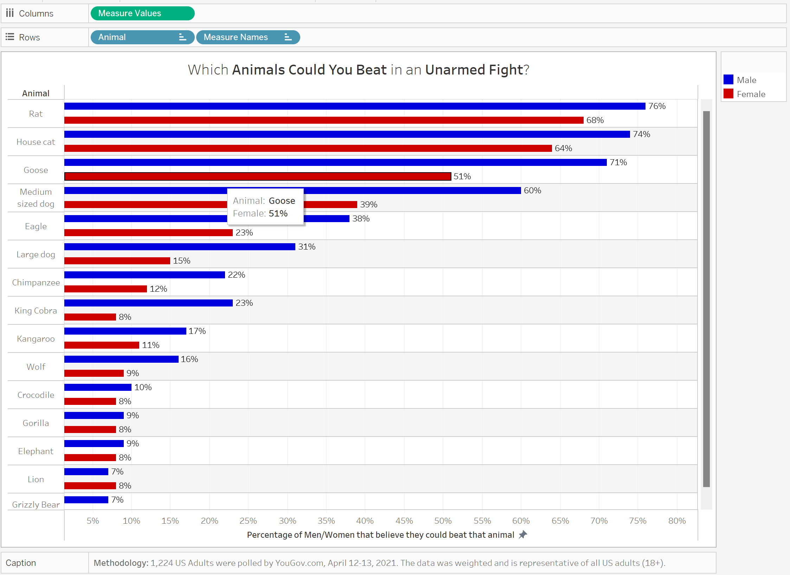

| [home page](https://cmustudent.github.io/tswd-portfolio-templates/) | [visualizing debt](visualizing-government-debt) | [critique by design](critique-by-design) | [final project I](final-project-part-one) | [final project II](final-project-part-two) | [final project III](final-project-part-three) |

# Critique by Design

## Step One: The Visualization

Which animals could _you_ beat in a fight? 

This Data Visualization asked 1,224 US adults which animals they believed they could defeat in a one-on-one fight:

This study was conducted by [YouGov](https://today.yougov.com/), an organization that collects public opinions and presents them through data charts or visualizations. If you would like to read the original article for this data visualization, click on this [link](https://today.yougov.com/society/articles/35852-lions-and-tigers-and-bears-what-animal-would-win-f)! 

I selected this visualization because I think the subject matter is interesting, and that it's also a little funny. It's hard for me to believe that 8% of women and 9% of men believe that they could beat an elephant _unarmed_. I love animals, and despite my picking on the data, I would be lying if I said I didn't have these same thoughts. I also have a few ideas on how this graphic can be improved, but I will lay out those details in the next section.

## Step two: The Critique
For this visualization, I assessed its quality using Stephen Few's [Data Visualization Effectiveness Profile](https://www.perceptualedge.com/articles/visual_business_intelligence/data_visualization_effectiveness_profile.pdf). In this article, Few recommends that data visualizations be judged on a scale of 1-10 from seven criteria: usefulness, completeness, perceptibility, truthfulness, intuitiveness, aesthetics, and engagement. By identifying how well the chart matches these seven categories, we can identify areas of improvement for the graphic. For this visualization, these were my rankings and reasonings for each of the seven criteria:

**Usefulness: 3/10**

Identifying usefulness was a little tricky. This is because this graphic is a tad frivolous. Is it useful information to know that 6-7% of people believe they could beat a grizzly bear unarmed? This was my initial reaction, but as I thought more about what the data was showing, I began to see that with only one exception (lions), men consistently outranked women in their belief in defeating animals unarmed. I don't care who you are, you are _not_ defeating a chimpanzee unarmed. Yet men outranked women by 10 percentage points (22% men to 12% women). For me, this shows that men may perceive how much danger they are in less or they believe in their own abilities more. This could be seen as valuable psychological information. If men perceive danger as less of a threat, they could be more at risk of causing accidents. Therefore, I'm ranking this as a **4/10**. To the average person, this graphic is just a fun hypothetical, which detracts from its inherent utility. However, I do believe that there are aspects of this data that can be valuable to people, and that's why I'm ranking it as a 4.

**Completeness: 9/10**

Completeness assesses a graphic by having all of the relevant data to make the visualization. I believe that this diagram has all of the necessary data to make its point. The designers chose a good selection of animals (by which I mean that there don't appear to be any odd decisions or obvious choices missing). The visualization also displays percentages by sex, which I believe is a useful measure. But is a person's sex all that matters? As I thought about the data, I thought of another interesting question to ask: _how fit would you describe yourself?_ I would be very interested to learn if a person believes they could take on more animals if they describe themselves as being more athletic. Because there are some questions that I wish the data would have answered, I am going to rank this category as a **9/10**.

**Perceptibility: 4/10**

Perceptibility describes how easy it is to read and understand the graphic. I think there are a few improvements that could be made. For example, men vs. women. I'm not sure the current format is the best way to visualize the data. The men vs. women markers don't make a continuous line down to the animal name, and this can make it a little difficult to differentiate between animals. For example, since the medium-sized dog and goose stretch out past the animal name, it can be difficult to easily trace the data back to the y-axis since the lines are so close together and so far away from the axis. Also, I think the color of men and women can be improved. Instead of purple and green, let's use blue for men and red for women. These colors are commonly associated with these sexes, and so using them would make it easier for the audience to recognize which is which. I would also flip the data, so the highest values at the top and the lowest values are at the bottom. For me, I like to think of things on a scale of easy -> hard, rather than hard -> easy. Therefore, it could be easier to read if the values were flipped. All-in-all, there is plenty of space for improvement, so I'm marking this visualization as a **4/10**.

**Truthfulness: 7/10**

Truthfulness measures that the data is accurately telling the story. I'd give near full marks on this point. While the data itself is accurate, I think the subtitle should be changed. I think it's very important to highlight that this is talking about people winning the fight _unarmed_. But I feel that because the subtitle is much smaller than the title, it's one of the last things the audience will read on the graph. This point is important because if this was a fight where the person could bring military-grade weaponry, then more people would think that they could win the fight. However, if someone knew that they were unarmed, then that may change things. Therefore, I would increase the size of the subtitle or add that the person is fighting unarmed to the title. All-in-all, I'd give truthfulness a **7/10**.

**Intuitiveness: 7/10**

Intuitiveness describes the ease of understanding the information. I think that there is some room for improvement. At the end of the day, this is just a bar graph. But whenever you first see the graphic, your eyes go down to the two points with a gray line connecting them, and it's a little confusing. It's an odd way of displaying the data. I think simple bar charts could be an easier way to view the data. I imagine the chart could be centered on the y-axis with the animal name, and then men and women can be on the x-axis, separated by the y-axis. Still, this graph is pretty simple to understand once you get your bearings, so I'm ranking intuitiveness as a **7/10**.

**Aesthetics: 5/10**

Aesthetics describes if the graphic is interesting to look at. I'm ranking it as a **5/10** because, to me, the graphic is very simple. It reports exactly what it needs to, and it gets the data message across. That being said, I wouldn't describe it as exceptionally beautiful, just very functional.

**Engagement: 10/10**

I think that this graphic excels with engagement. Anyone can imagine themselves fighting with these animals, and so I think that the graphic works perfectly for sharing this with friends and debating on which animals you could take on. I think the hypothetical proposed by this graphic would stimulate engagement, so I am giving engagement a **10/10**.

## Step three: Sketch a solution

Here was my first attempt at sketching a new visualization:

## Step four: Test the solution

For my interviews, I asked the following questions: 

- _Q1:_ Can you tell me what you think this is?

- _Q2:_ What was the first thing that caught your eye?

- _Q3:_ How easy was it to understand what this graph was about?

- _Q4:_ How would you improve this graph to make it easier to read?

- _Q5:_ Who would the intended audience be for this chart?

**Interview 1**

  - _Q1:_ This is a graph talking about which animals women and men think they could beat in a fight.
  
  - _Q2:_ The first thing I noticed was the bright colors.
  
  - _Q3:_ It was easy to read, minus your bad handwriting. (ouch)
  
  - _Q4:_ I would make the two graphs for men and women beside each other. Since the differences aren't particularly drastic, it would be better to have them side by side.

  - _Q5:_ This graph is meant for anyone, no particular audience.

**Interview 2**

  - _Q1:_ Survey results about what animals people think they could defend themselves against unarmed.
  
  - _Q2:_ The animal list and the fact that men felt more confident than the women in their abilities to overcome the animals.
  
  - _Q3:_ I think it was pretty easy to understand, albeit I have some questions that I would like to know.
  
  - _Q4:_ Some thoughts: 1) I would use a photo of the animals for quicker impact, or even a Human vs. ______ in a boxing ring, and 2) a little more info regarding the demographic and number of people surveyed and 3) emphasize “unarmed.”

  - _Q5:_ I would think this is one of those fun studies for all people to analyze or to think about what your own answers would be – like pop culture group discussion stuff. There is likely an interest from psychologists as to people’s confidence or their own perception of their physical prowess. Maybe another interesting thought here is what percent DOESN’T think they can win the fight (~30% of people don’t think they could beat a rat or house cat)! And the men are truly underestimating the Cobra and Chimp, in my opinion, LOL.

Synthesis: 

From the feedback I received, I think I should make the unarmed aspect even more prominent. I could add diagrams of the animals to add another visual, though I wonder if that would add too much clutter. I think I will test this in Tableau and decide if it's too much. I can add the men and women diagrams side by side instead of on two opposing sides.

## Step five: build the solution

With my interviews finished, I set out into Tableau to try and build a visualization that met what the interviewees told me. What mostly stuck out to me was designing the graphic with the men and women side by side. This is how it went:

I don't like it. I think the colors and bars just mash together and make it feel like a mess. After speaking with my data visualization critique group, they shared my sentiments. I decided that I should try to create the visualization to be more similar to my sketch and to drop the side-by-side idea.

<noscript></noscript><object class='tableauViz'  style='display:none;'><param name='host_url' value='https%3A%2F%2Fpublic.tableau.com%2F' /> <param name='embed_code_version' value='3' /> <param name='site_root' value='' /><param name='name' value='HumanVs_Animal&#47;Sheet1' /><param name='tabs' value='no' /><param name='toolbar' value='yes' /><param name='static_image' value='https:&#47;&#47;public.tableau.com&#47;static&#47;images&#47;Hu&#47;HumanVs_Animal&#47;Sheet1&#47;1.png' /> <param name='animate_transition' value='yes' /><param name='display_static_image' value='yes' /><param name='display_spinner' value='yes' /><param name='display_overlay' value='yes' /><param name='display_count' value='yes' /><param name='language' value='en-US' /></object>
                

_Include and describe your final solution here. It's also a good idea to summarize your thoughts on the process overall. When you're done with the assignment, this page should all the items mentioned in the assignment page on Canvas(a link or screenshot of the original data visualization, documentation explaining your process, a summary of your wireframes and user feedback, your final, redesigned data visualization, etc.)._

