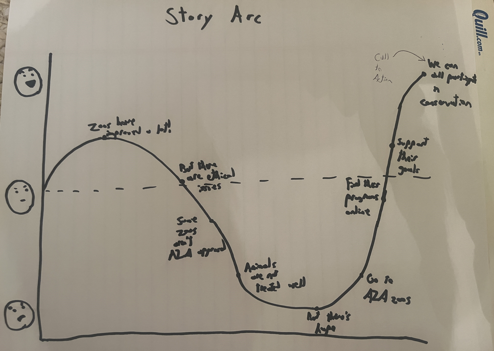
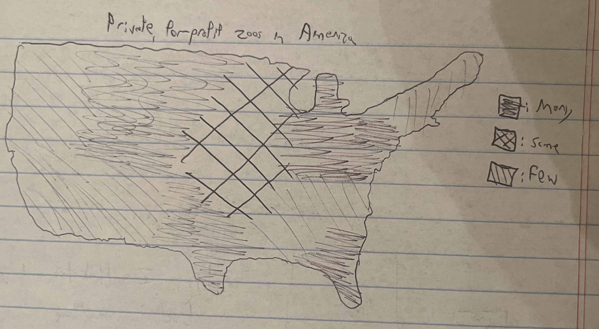
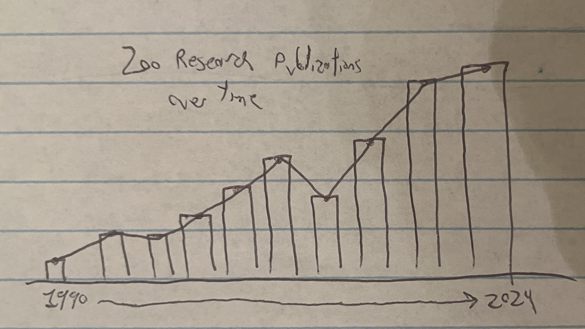

| [home page](https://cmustudent.github.io/tswd-portfolio-templates/) | [visualizing debt](visualizing-government-debt) | [critique by design](critique-by-design) | [final project I](final-project-part-one) | [final project II](final-project-part-two) | [final project III](final-project-part-three) |

# Outline 
For my topic, I would like to talk about zoos, how ethical they are, and the conservational work they achieve. I have always loved zoos. They are some of my favorite places to visit. I love getting to see and learn about new species. I also find zoo design fascinating, such as how a zoo decides to showcase its animals, how they choose where their species are located relative to one another (some appear random, some have themes), and how each zoo takes a different stance on educating people about climate change and other human impacts on the natural world.

I also know that zoos have seen their fair share of controversies. Perhaps the biggest is the discussion around putting these animals on display. _Are these animals in zoos for their benefit or for our benefit?_ As someone who personally loves zoos, this question has always stuck around with me. At what point are zoos not helping their animals and are just profiting from them for entertainment? In this data story, I want to dive into the pros and cons of modern zoos. I want to talk about these animals being constrained in zoos, but also the conservation work that is achieved in zoos.

It is at this point that I have to admit my bias. Not only do I love zoos as a guest, but I was also a zookeeper for the Oglebay Good Zoo. I'm attaching one of my photos from this job, this is Hamlet the Red Panda.

I believe that this is an important aspect of my story because I have some inside information on how zoos work as a staff member. I will talk a lot about the Association of Zoos and Aquariums (AZA) in this story, which is the main symbol of quality for zoos. The AZA forces members to follow strict guidelines to ensure animal happiness above all else, failure to comply with these guidelines will result in the zoo getting kicked out of the organization. The Oglebay Good Zoo is privileged to be the only zoo in West Virginia to have AZA status, which we took with great pride. Being an AZA zoo means that we have access to a breeding network to ensure genetic quality in our animals to return them to their natural environment hopefully. At Oglebay, we had two breeding pairs of Carolina Red Wolves, which are a critically endangered species. We took special care to ensure that these animals would be re-wilded, we didn't even give them names and the wolves couldn't see us filling their food containers so that they wouldn't trust people to feed them. All of this is to say AZA zoos take great care for conservation and ensuring animal happiness. Yet there is still a lot of improvement that can be made. I do believe animals could have larger enclosures, and it can be immoral to keep very intelligent species, such as elephants, cetaceans, and Great Apes, in captivity. I'm hoping to strike a balance between what zoos are doing well and what can be improved in this presentation.

**Project Structure**

For my story, I want to start on a positive note. I want to acknowledge that zoos have improved a lot since the 19th century. When zoos were first being built, they were a place for pure entertainment. There was no educational aspect to zoos, and the animals were kept in small, fully concrete pens. Now, animals are kept in habitats that try to mirror their natural environment. Animals are diets appropriate for their species, and they are given daily enrichment and areas to hide from the prying eyes of zoo guests. 

However, these advancements are still not fully adequate. I want to show that although animal habitats have improved, they are very far from perfect. I would like to use a study from the UK that found that only 10% of zoo animals have habitats that are similar to their real-world range, and the average for mammals shows that these habitats are 100x smaller than their natural range [(PDF Link, Page 12)](https://animal-protection-consult.com/enclosures.pdf). This will invoke some anger or disappointment in the audience.

I then want to find out how many zoos are not members of the AZA. This is important because non-AZA zoos have few restrictions on what they can do with their animals. If you have ever watched "Tiger King" or "Black Fish," you can see the horrors that some animals are put through in zoos and aquariums. Tiger King mainly focuses on how private, for-profit zoos can impact large cats. Black Fish focuses on SeaWorld (a for-profit aquarium and not an AZA institution) and their mistreatment of Orca Whales. There are many for-profit zoos in the United States. My girlfriend and I went to [Living Treasures Animal Park](https://ltanimalpark.com/) a few years ago (which is for-profit, not AZA) and some of the habitats made me feel really sad for the animals at this facility. Every habitat used a mesh fence with little to know trees, meaning the animals had no hiding spots and could not get under shaded areas. It should be noted that not all for-profit zoos are like this, but because the Department of Agriculture's guidelines are limited, zoos can get away with too much. At this point, I want my audience to be pretty upset with zoos.

But now I want to shift focus. I want to highlight the zoos that are really striving to do good work. The AZA lists some [interesting zoo and aquarium statistics](https://www.aza.org/connect-stories/stories/interesting-zoo-aquarium-statistics) which I would really like to highlight in this section. This includes AZA zoos housing over 900 species of endangered animals, AZA zoos spend nearly $20 million+ on their animals, and AZA zoos collectively spend over $230 million dollars on conservation research **per year**. I also have some international data where we can study more on how zoos are studying endangered animals, more on that in the data section. Finally, I have some data on how much research zoos are publishing to the academic world. Since the 1990s, zoos have massively increased their amount of research in zoological journals. Many zoos hire researchers from local universities to come and study their animals, which can help scientists around the world better understand the animal ecologies and how to best prepare conservation plans. The people working at these zoos truly care about these animals and want them to thrive. In this section I really want to highlight the good work that zoos provide to boost the audience back up to neutral, maybe slightly positive.

Finally, I want to end strong with a call to action. I will suggest that audience members can volunteer, though I know that it is unlikely. At the very least, I am going to stress that the audience should find AZA-listed institutions near them and go and enjoy their time at the zoo. Zoos often ask for donations which can directly contribute to their conservation and research funds. I really want to highlight that the audience has the power to help fund these conservation efforts. I want to make the listener feel like an active cog in helping mitigate the worlds climate impact. Ending on this high can hopefully motivate people to go visit the Pittsburgh Zoo (which just got its AZA status restored last week!).

## Initial sketches
I am including some sketches of some visualizations I anticipate creating for this project. These are crude depictions as I don't have the exact data for all of these sources yet, but this is how I anticipate they will look.

For this visualization, I want to show how habitats have changed over time. I want to compare the sizes of the 19th-century pen to the modern habitat. But, both of these obviously are tiny when compared to the natural range of the animals. I think showing these sizes as a visualization can be really impactful for the audience as it shows the true scale of how small zoo habitats can be.

For this visualization, I'm hoping to find data that breaks down private, for-profit zoos per state and creating a map that compares states in how many of these zoos they have. I am anticipating states with fewer restrictions will have more private zoos. Showing how many private zoos are in America can point towards a greater problem that not all of these places are taking the best care of their animals, and that's a problem.

In this visualization, I want to break down where the zoo's conservation budget goes. I have two different aspects I want to highlight. I have data on which projects are funded by zoos and which taxonomic groups are funded by zoos. I think both of these visualizations can help audience members see exactly what a zoo's conservation budget can be used for.

Finally, I would like to create a visualization that shows how many research papers are being published by zoos and how that has changed over time. From the data that I've seen so far, the number has really begun to rise since the 1990s, so I want to show the impressive work being down by zoos in this visualization.

# The data
| Name | URL | Description |
|------|-----|-------------|
|   International Zoo Statistics   |  [GitHub Link](ZooStats.csv)  |      Many zoo statistics such as abundancy of endangered species, total mammals, and zoo attendance     |
|   Evaluating the Contribution of North American Zoos and Aquariums to Endangered Species Recovery   |   [Webpage Link](https://www.ncbi.nlm.nih.gov/pmc/articles/PMC6023936/)  |      Research Article showing what zoos are doing with their conservation budget      |
|   Pittsburgh Zoo's 2021 Annual Report   |   [Webpage Link](https://www.pittsburghzoo.org/wp-content/uploads/2024/06/22_AnnualReport_8.1mb.pdf)  |     Webpage talking about Pittsburgh Zoo's Revenue and their conservation achievements        |
| The Pittsburgh Zoo & Aquarium boasts 8,000 animals on 77 acres. A growing chorus asks: Why do we have zoos? | [Webpage Link](https://www.publicsource.org/pittsburgh-zoo-aquarium-animal-captivity-conservation-rescue/) | Website talking about Pittsburgh Zoo's pros and cons |
| Why zoos are good | [Webpage Link](https://www.theguardian.com/science/lost-worlds/2014/aug/19/why-zoos-are-good) | Guardian Article writing about conservation and education done by modern zoos |
| Do zoos help or hurt animals? | [Webpage Link](https://www.vox.com/future-perfect/23914885/zoo-animals-conservation-endangered-threatened-species-sanctuaries) | Vox article on how zoos hurt animals and how zoos can improve |
| Interesting Zoo and Aquarium Statistics | [Webpage Link](https://www.aza.org/connect-stories/stories/interesting-zoo-aquarium-statistics) | AZA website listing zoo statistics |
| Enclosure Size in Captive Wild Mammals | [PDF Link](https://animal-protection-consult.com/enclosures.pdf) | Study on enclosure sizes in zoos |
| Guiding the prioritization of the most endangered and evolutionary distinct birds for new zoo conservation programs | [Webpage Link](https://onlinelibrary.wiley.com/doi/10.1002/zoo.21482) | Study on how endangered bird populations have been impacted by zoos conservation programs |
| Global trends in research output by zoos and aquariums | [Webpage Link](https://conbio.onlinelibrary.wiley.com/doi/full/10.1111/cobi.13757) | Study finding that zoos are contributing more research papers in recent years |
| Market size of the zoo and aquarium sector in the United States from 2010 to 2022 | [Webpage Link](https://www.statista.com/statistics/1176774/zoo-and-aquarium-industry-market-size-us/) | Chart from Statista showing Zoo and Aquarium Market Size between 2010 through 2022, size has mainly remained the same |
| A system wide approach to managing zoo collections for visitor attendance and in situ conservation | [Webpage Link](https://www.nature.com/articles/s41467-020-14303-2) | How zoo attendance is used to contribute to conservation projects |

# Method and medium
I plan on completing more research as I don't have all of my data just yet. My first step is to locate more databases so that I can get more reliable data on some of my numbers. I also want to use Tableau to create my visualizations and then upload those to Shorthand to present my story.
