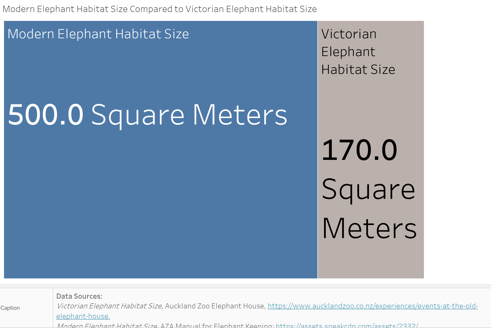

| [home page](README.md) | [visualizing debt](visualizing-government-debt.md) | [critique by design](critique-by-design.md) | [final project I](final-project-part-one.md) | [final project II](final-project-part-two.md) | [final project III](final-project-part-three.md) |

# Wireframes / storyboards

This week, I developed some of the visualizations for my final presentation. These are the four I knew I wanted to include, but I may develop more or refine these designs depending on the feedback I receive. If more information would be necessary to make my point known, then I will create more visualizations to make my story stronger. If one of my visualizations are confusing or hard to understand, I will make the edits as needed to make sure anyone can read and understand my story.

This story will talk about how zoos have evolved from the Victorian "menagerie" of the late 19th century into conservation and research institutions in the 21st century. To give a baseline of where this story begins, I will first show this visualization:

In this visualization, I want the viewer to see that Victorian Zoos, which are gray and displayed on the right, have a much smaller area compared to modern zoo habitats. It was very difficult to find the size of Victorian animal habitats, but thankfully, I finally found that the Auckland Zoo recorded their Elephant House size, which was around 170 square meters. The AZA releases guidebooks for keeping many animals in captivity, and part of these guidelines include the minimum amount of space needed for these animals. For the African Elephant, the minimum amount of space needed is 500 square meters, which is nearly 3 times the size of the Victorian habitat. Although this is the minimum, most modern zoos vastly expand on this number.

I will then transition into talking about how many AZA zoos are in the United States. Here is a map of the number of zoos in the continental United States:

I want to highlight the importance of going to an AZA zoo as they are the main regulating body that determines what are "good" zoos and what are "bad" zoos. This is because the AZA does not allow zoos that do not meet their strict requirements for animal enrichment, habitat size, and conservation work, to enter the organization. If a zoo is not a member of the AZA, they are far less restricted on what they can do with their animals or how they spend their budget. Being a member of the AZA gives a lot of respect to these organizations and allows visitors to know that this zoo does care about conservation, research, and wellness for their animals. The viewer of this map should notice that the vast majority of AZA zoos are centered around California, Texas, and Florida. These states have larger populations and larger tourist destinations, so they are able to maintain a greater number of zoos when compared to states such as Nevada or West Virginia, both with just one AZA zoo.

In this next visualization, I want to dig more into the conservation work being done by AZA zoos. Here is the bar graph visualization of the work done by AZA zoos by program:

In this visualization, I want the viewer to understand that by going to AZA zoos, the money they spend at these institutions is going to real-world conservation projects. I went through a lot of variations of this visualization, it was originally a pie chart, but I really didn't like the readability. Because some of the lower budget items are so small, there was a lot of text put onto these small spaces. In addition, you could see the approximate percentage of the pie, but that didn't translate into how much money was being spent per program. After a lot of renovations to the pie chart, I ultimately decided that a bar chart would be better suited to displaying this data. It gave the smaller percentages equal spacing so that the labels weren't clustered together. It also labeled the actual money spent on these programs, which translates much more into real-world action. If I told you that around 45% of a zoo's conservation budget went into assurance populations, that wouldn't mean as much as saying zoos spend an average $11.5 million dollars on this specific program. The money speaks louder than the percentage.

Finally, this visualization is used to show the viewer how zoos have increased their research budget over time:

In this visualization, the average number of research papers published by zoos (blue bar graph) is shown to be increasing over time. In addition, the impact that this research is generating (orange line graph) is increasing as well. This graph shows the viewer that not only are researchers at zoos publishing at a greater pace, but the research they are providing is also having a greater impact on conservation and biological research. This graphic was originally more confusing because I couldn't figure out how to synchronize the two data axes, so the right axes was different to the left axes, which I found to be confusing. Once I synchronized the axes, the impact line shot upwards to where it should have been and showed that the citations were always greater than the number of papers produced. I'm still unsure if this graphic is perfect, I think "Impact" might be a bit confusing. At the same time, "number of citations" may also be a bit confusing. This is the graphic I am most excited to hear feedback about.

For the call to action of my story, I want to emphasize the importance of going to AZA zoos. The [AZA website](https://www.aza.org/search-by-zip-code) allows guests to type in their city name and desired search radius to find which AZA zoos are closest for them to visit. If more people knew and supported these zoos rather than private establishments with no restrictions, more people can support wildlife conservation efforts and support the wellness for the animals within these facilities.

# User research 

## Target audience

For this story, the target audience could be seen as the general public, but I want to narrow this definition down more. There are two opposing sides to my story, how zoos are damaging animals and the conservation work done by zoos. Since my goal is to balance these opposing ideas of zoos, my target audience should be a representative of both of these groups. Here is my idea:

**Opposing Modern Zoos Representative:** _Someone who deeply cares about Animal's Rights_  

This audience member deeply cares about the right of animals to live healthy and well. This person would probably agree with the statement that animals are being treated as entertainment in zoos and that these same animals would lead healthier, more fulfilling lives if they were returned to the wild. I imagine that this group of people may have loved zoos when they were little, but have become disillusioned as they have grown up. That is why this group would much prefer zoos to either release their animals or completely transition to a new form where animals are given many acres of land as habitats, such as the [North Carolina Zoo](https://www.nczoo.org/visit/about-zoo#:~:text=From%20critically%20endangered%20vultures%20and,for%20more%20than%20two%20decades.&text=Just%20a%20reminder%E2%80%A6,world's%20largest%20natural%20habitat%20zoo.), which is the largest habitat zoo in the world, boasting over [2,800 acres](https://www.dncr.nc.gov/news/press-releases/2024/03/13/north-carolina-zoo-ranks-among-top-10-best-zoos-nation#:~:text=As%20the%20world's%20largest%20natural,treat%20for%20its%20golden%20anniversary.) of land.

**Supporting Modern Zoos Representative:** _Someone who deeply cares about the Conservation and General Education of these Animals_

This audience member deeply cares about animal conservation in our rapidly changing world. This person would probably agree with the statement that animals should be kept in zoos to learn more about them, educate the general public, and support these organizations that directly fund animal conservation work. I imagine that this group of people may talk about the millions of dollars being generated by zoos that go into supporting conservation projects around the world. This group of people may also prefer animals being released to the wild but also supports the idea of maintaining and growing vulnerable animal populations as needed to maintain our world's conservation. They may point to lists such as from the [Taronga Conservation Society](https://taronga.org.au/news/2017-05-22/10-endangered-species-saved-extinction-zoos) that find that many species, such as the California Condor, Bongo, and Golden Lion Tamarin, have been saved from extinction due to the conservation work performed by zoos.

**Synthesis between these Representatives:**

Ultimately, what I need to focus on is that these two groups of people are not completely at odds with one another. If you look at their core beliefs, we'll find that both of these groups of people _deeply care about the well-being of these animal populations._ These two groups are united by this idea, they simply have two different ideas on how to carry this out. For this presentation, I don't want to take a side of this argument, I want to focus on what's important to both of these groups: animal welfare.

## Interview script

For my interview, I plan on showing the interviewees only my visualizations. I don't want them to read what I have to say about these visualizations or have me explain the story. I want their pure thoughts on what the data visualizations are saying without knowing my story first. I plan on showing the viewer each of the four visualizations before asking the following questions:

| Goal | Questions to Ask |
|------|------------------|
| What do they not understand?     |         Overall, were you able to understand what each graphic was saying, or were the graphics confusing?         |
|   What improvements should be made?   |        What would you change about the graphics to make them better to understand or look better?          |
|   Are they getting the message I want them to get?   |        What do you think of the message that these graphics are trying to tell?          |
|   Who is the Target Audience?   |       Is there a specific audience that would be interested in these graphics?           |
|   What information am I missing that would be helpful?   |        Are there any aspects that you are curious about that were not addressed in this draft?          |

From their responses, I'm hoping to learn what worked, what needs to improve, what message am I sending, who would want to hear that message, and what I am missing from the visualizations. I hope that I will get a good amount of data from this exercise!

## Interview findings

Text here!

| Questions               | Interview 1 | Interview 2 | Interview 3 |
|-------------------------|--------------------------------|-------------|-------------|
| Overall, were you able to understand what each graphic was saying, or were the graphics confusing? | 1            |     2        |       3      |
| What would you change about the graphics to make them better to understand or look better?                        |             1                   |      2       |        3     |
|   What do you think of the message that these graphics are trying to tell?                    |             1                   |      2       |        3     |
|   Is there a specific audience that would be interested in these graphics?                     |             1                   |      2       |        3     |
|    Are there any aspects that you are curious about that were not addressed in this draft?                     |             1                   |      2       |        3     |

# Identified changes for Part III
> Document the changes you plan on implementing next week to address any issues identified.  

Text here!

| Research synthesis                       | Anticipated changes for Part III                                                |
|------------------------------------------|---------------------------------------------------------------------------------|
| Findings or observations from interviews | Describe what, if any changes you anticipate making to address the observation. |
|                                          |                                                                                 |
|                                          |                                                                                 |
|                                          |                                                                                 |
| ...add more rows as necessary            |                                                                                 |

> ...include any final thoughts you have here. 
